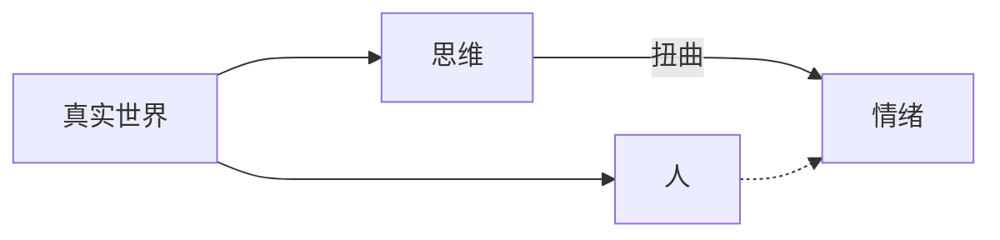

# Burns新情绪疗法

## 认知疗法与情绪抑郁

### 认知疗法介绍

- 认知疗法可以：
  - 快速改善症状
  - 了解自己：知道自己为什么喜怒无常、调节情绪的方法、如何评估和诊断严重程度
  - 自我控制
  - 预防抑郁
- 认知疗法经过了科学研究和审查并确定拥有效果。
- 认知疗法有可靠的学术基础。
- 认知疗法的原则
  - 所有情绪都来源于“认知”或思维
  - 情绪消沉时思维会被无法摆脱的消极感左右
  - 乐观的心态和治疗非常重要

### 诊断情绪

- 使用Appendix中的Burns抑郁状况自查表来自测并对照得分说明评估自身状态。最好一周一次。
- 自杀倾向问题中任何一个的得分偏高都应引起治疗
  - 第23项的得分偏高但后两者为零的情况比较不严重和普遍。
  - 第24、25项有得分偏高都应警惕。
  - 第22项表明疑病倾向，但也应当全身检查并检验病史来排除健康问题。
- 感觉自己十分疯狂、害怕自己会失控的人往往相对更正常，只是普通的症状；觉得自己拥有这些症状没事却抗拒心理治疗的人往往更严重。
- 不足以完全自助来解决的症状
  - 被害妄想
  - 感觉怪诞，常人无法理解
  - 感到/相信外部力量在控制自己
  - 觉得别人能知道自己的念头或想法
  - 幻听和幻觉
  - 搜集个人留言并认为其是特工联系之类的妄想
  - 狂躁
    - 症状：
      - 极端的喜怒无常（与药物无关）且至少持续两天
      - 行为冲动鲁莽、几乎没有判断力（如挥霍无度）、自信心过度膨胀
        - 觉得自己才华横溢、无所不能、马上就要有突破性成果或赚钱方案
      - 纵欲和攻击性行为增加
      - 身体活跃、坐立不安、心神不宁
      - 滔滔不绝、兴奋过度
      - 减少睡眠
    - 产生的症状令人沉迷而患者无法接受这是病的症状
    - 可能在几天内会转变为抑郁或谵妄[^谵妄]

[^谵妄]: 谵妄是一种以兴奋性增高为主的高级神经中枢急性活动失调状态，患者在意识清晰度降低的同时往往会出现定向力障碍，包括时间、地点、人物、定向力及自身认识障碍。此外患者会产生大量幻觉错觉。幻觉以幻视多见，内容多为生动逼真且鲜明的形象。在感知障碍的影响下，患者多有紧张恐惧性情绪反应，包括兴奋不安、行为冲动、杂乱无章、喃喃自语、吼叫不休、对空搏斗、惊恐逃跑等；思维方面表现为不连贯、难以理解，有时会出现片段妄想。

### 思维决定情绪

- 认知疗法认为坏情绪来源于扭曲的消极思想和悲观态度
- 强烈的消极思想往往伴随抑郁发作和与之相关的痛苦情绪。
- 为某事闷闷不乐时，找一找此前是否有与之对应的消极思维

- 如上图，情绪源于看待事物的方式

#### 认知扭曲的十种方式

1. 非此即彼思维/极化思维
   - 会让人害怕任何错误或不完美之处
2. 以偏概全
   - “一旦发生过以后都会发生”
   - “坏事总是发生/总在我头上发生”
   - “没人会喜欢我”
3. 心理过滤/选择性失明
   - 从情景中挑出负面部分并反复回味，从而觉得一切都消极
4. 否定正面思考
   - “哪怕对方有99%的责任，我就没有1%的责任吗？”
   - 认为他人的赞美是虚伪，而认为否定是真实的
   - 自己的成就都是意外得来的：因此我很没用
   - “没人关心我，关心我的人除外”
5. 妄下结论
   - “读心术”：因为某件事，某人一定在讨厌我
   - “先知错误”：“我就知道我很不幸”“我觉得我会一直抑郁下去，我完全肯定，任何治疗都没用”
6. 放大自身错误，缩小自身优点
7. 情绪化推理
   - “我觉得我是废物，因此我肯定是废物”
   - “我内疚，所以我做错了什么”
   - “我烦你了，所以你对我很坏”
   - 因此会导致拖延：“这么多事我做不完了”“这件事太困难了”
8. “应该”句式/必须强迫症
   - 他人的道德低于自己的：“他怎么这么自私？”
   - 自己的表现低于预期时：“我不应该这么笨/这样做”
9. 乱贴标签
   - “我是个废物”“她就是个贱人”“我真是一头猪”
10. 罪责归己
    - 认为负面事件责任在于自己，哪怕自己与之无关
    - “我肯定是个糟糕的...”

## 实际应用

### 建立自尊

- 大部分抑郁患者自厌，（在自卑的作用下）渴求认为自己匮乏的事物，如智慧、成就、力量
  - 4D: Defeated, Defective, Deserted, Deprived
- 大量症状（恐惧、焦虑）都可以归结于此（**如何归结？**）
- 自己会坚定地厌弃自己，并说服他人接受
- 自尊/自我价值感并不来源于成功或被爱，但前者决定了自身感受
- 认知疗法可以强硬地抵制自卑感：
  - **如果坚持认为自己毫无价值，则应该仔细分析自我评价，并要求拿出证据**
- 抑郁患者和精神分裂患者（尤其后者）的思维在形式上有障碍
  - 太注重具体细节而无法准确概括含义[^fast_note_1]；理解力和逻辑上有问题
  - 因此会难以正常思考/理解事物，而逐渐认为一切的消极就是消极的一切
- **自卑时，查看上一章的认知扭曲列表并逐条对照**。看清自己时容易有非此即彼思维。

[^fast_note_1]: 比如我现在做的：我在写上面东西的时候简直就像在抄书。除了书的内容有点散杂在段落之间之外，另一个原因是我阅读的注意力不够集中，以至于我觉得我有必要记或写很多东西，但这显然是不必要的，而只是因为我在逃避或回避我的注意力不集中。

- 对于克服自卑，除认知疗法之外的疗法
  - 尊重患者，允许患者倾吐：但实际上不能给出客观评价，并进一步加深患者的负面自我认同
  - 在医生退为被动时长时间沉默：更加不安/焦虑/抑郁，更沉浸于内心的批评
  - 单纯的情绪宣泄：不足以改变思维方式和行为方式，很可能只是暂时的好转
  - 通过自我分析和精神分析来得到自身的解释：**仅仅知道**无法改变自己，没有改变的方法，没有生活的新方法
- 认知疗法
  - 迅速改变思维方式、感知方式和行为方式
  - 需要采用实际且可以持之以恒的训练方法
  - 仅靠阅读无法提升自尊（不能长期有效），而需要思考并实践，并每天都做

#### 提升自尊的方法

1. 反驳自我批评
   - 三个步骤：
     1. 识别并记录那些自我批评的念头（需要训练）
     2. 找出思维扭曲的根源（参照第二章的相关表格）
     3. 反驳它们，从而培养更客观的自我评估体系
   - 三栏法
     | 下意识思维（自我批评） | 认识扭曲    | 理性回应（自我辩护）|
     |-|-|-|
     | 1. 我什么事都做不好    | 1. 以偏概全 | 1. 我有很多事都做得很好 |
     - 想不到理性回应可以以后慢慢想，或向别人求助
     - 下意识思维栏不要写描写情绪反应的句子（*“我快烦死了”*）而要觉察其中自我批评的部分[^fast_note_2]
   - 更细致的“消极思维日志”[^note_3]
     | 情景 | 情绪 | 下意识思维 | 认知扭曲 | 理性回应 | 结果 |
     | ------------------------ | -------------------------------------------------- | ---------------------------- | ---------------------------------- | -------------------------------- | ------------------------------ |
     | 简述导致不愉快情绪的事件 | 1.指定不愉快情绪的种类 2.用百分之表示情绪的程度 | 写下伴随不良情绪的下意识思维 | 确定一个下意识思维中存在的认知扭曲 | 针对下意识思维写下对应的认知扭曲 | 用数字来表示写下日志前后的心情 |
   - 仅仅在脑中想一下如何理性回应是不够的，还需要下笔写出来。**记录**下来。
   - 每天需要15分钟写下自己的下意识思维并予以理性回应。
2. 心理生物反馈
   - 想到一个贬低自己的消极念头时，按一下计数器，以监控自己的思维。记录每天的总分。
     - 一开始会不断增加（检查自我批评思维水平增高）
     - 进入停滞期（7-10天）
     - 总分开始下降
     - 一般需要三周时间见效
     - 这是由于系统性自我监控可以增进自控能力
   - 需要配合1.的

[^fast_note_2]: 我在想这种认知疗法实际上是在那些意识出现的时候用自己的意识强硬的抵制它们，因此你可以说是抵触方在获益，但是以对抗性的方式，但也不错了。我在想，这实际上是在以理性的方式增强自我。其实我刚刚想到了一些东西，比如这个东西是利于超我，或给自己一个理性的超我的。但实际上这是偏见。
[^note_3]: 这玩意儿太西式了，还是需要一定的改进。

## Appendix

### Burns抑郁状况自查表(BDC) [^如何填表] [^附加说明]

[^如何填表]: 在每个问题中填写数字（0-完全没有；1-有一点；2-偶尔；3-经常；4-极其频繁）并在填写结束后加起来，以此对照得分说明检验自身状况。
[^附加说明]: 总分如果一直为10分以上则可能需要专业治疗。如有自杀倾向请务必立即找心理健康专家就诊。

- 感想和感受
  1. 感到悲伤或情绪低落
  2. 觉得不快乐或忧伤
  3. 动不动就哭或眼泪汪汪
  4. 感到沮丧
  5. 感到无助
  6. 缺乏自尊
  7. 觉得自己没用或无能
  8. 有内疚感或羞耻感
  9. 自责自怨
  10. 优柔寡断
- 活动和个人关系
  11. 对家人、朋友和同事没兴趣
  12. 感到孤独
  13. 陪家人或朋友的时间很少
  14. 失去动力
  15. 对工作或其他活动没兴趣
  16. 逃避工作或其他活动
  17. 觉得生活不快乐或不满足
- 生理症状
  18. 感到疲倦
  19. 失眠或总是昏昏欲睡
  20. 食欲下降或上升
  21. 失去性欲
  22. 担心自己的健康状况
- 自杀倾向
  23. 有任何自杀的念头
  24. 想结束生命
  25. 有自残计划

|  总分  |        抑郁程度        |
| :----: | :--------------------: |
|  0-5   |         无抑郁         |
|  6-10  | 正常程度但情绪有些低落 |
| 11-25  |        轻微抑郁        |
| 26-50  |        中度抑郁        |
| 51-75  |        严重抑郁        |
| 76-100 |        极度抑郁        |
